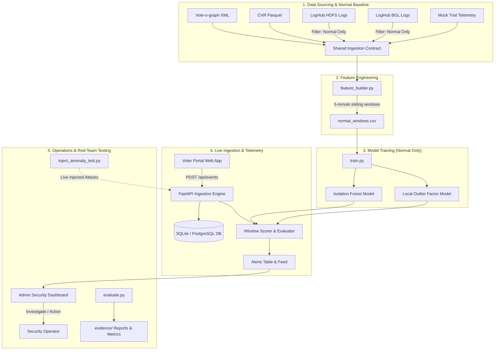

# Intelligent Security Monitoring System for E-Voting (ISMSF)
## Master Implementation Plan

> **Core Philosophy**: Train models exclusively on *normal, legitimate behavior* using unsupervised anomaly detection (Isolation Forest and Local Outlier Factor). No attack data is introduced during training. System resilience is tested through live red-team anomaly injection and independent log cross-benchmarking.

---

## 1. System Architecture

---

## 2. Implementation Phases & Methodology

### Phase 1: Environment & Project Scaffolding
- Establish standard directory tree (`ml/`, `ingestion/`, `evoting_site/`, `dashboard/`, `data/`, `evidence/`).
- Initialize local virtual environment with pinned packages from `requirements.txt`.
- Configure local SQLite database (and PostgreSQL compatibility for production).

### Phase 2: Database Schema & Ingestion Core
- Implement SQLAlchemy and Pydantic models conforming to `Schema_API_Reference.docx`:
  - `sessions`: session lifecycles, voter registration tokens, source tagging.
  - `events`: append-only immutable event logs (`login`, `auth_fail`, `vote`, `nav`, `admin_access`).
  - `window_scores`: aggregated 5-minute telemetry features, IF/LOF scores, and risk tiers (`Low`, `Medium`, `High`).
  - `alerts`: actionable security incidents with human-in-the-loop audit trails (`investigated`, `notes`).
  - `trials`: metadata tracking for controlled mock election trials.

### Phase 3: Data Sourcing Loaders & Standardization
- Create unified loaders adhering to the common schema contract:
  - `timestamp`: UTC ISO datetime
  - `session_id`: Unique session identifier
  - `event_type`: Categorized action type
  - `ip_address`: Source IP (or `None` when absent)
  - `source`: Dataset identifier (`voteograph`, `cvr`, `hdfs`, `bgl`, `trial`)
- Enforce strict ground-truth filtering: filter out labeled anomalies from HDFS/BGL during training ingestion, staging them in a separate evaluation partition.

### Phase 4: 5-Minute Window Feature Engineering
- Build `feature_builder.py` computing:
  - `event_count`: Total event volume per 5-minute window.
  - `vote_count`: Total voting transactions in the window.
  - `failed_login_ratio`: Failed authentications divided by total login attempts.
  - `inter_arrival_variance`: Variance in inter-event arrival timestamps (collapses under automation).
  - `distinct_ip_count`: Unique IP count (handled gracefully when IP is null).
  - `ip_entropy`: Shannon entropy over IP distributions.
- Validate data cleanliness: enforce assertion that no attack-labeled rows exist in `normal_windows.csv`.

### Phase 5: Unsupervised Model Training
- Implement temporal splitting: 60% Train, 20% Validation, 20% Held-Out Normal Test.
- Train Isolation Forest (`contamination='auto'`, `random_state=42`).
- Train Local Outlier Factor in novelty mode (`novelty=True`, `contamination='auto'`).
- Establish baseline alert thresholds at the 95th percentile of normal training scores.
- Persist trained models to `ml/models/isolation_forest.joblib` and `ml/models/lof.joblib`.

### Phase 6: Voter Portal Prototype
- Modern, clean, accessible voter-facing web portal.
- Submits telemetry to `POST /api/events` and `POST /api/sessions` for:
  - Voter login and authentication failure events
  - Ballot navigation events (`nav`)
  - Vote submission transactions (`vote`)
  - Session termination (`ended_at`)

### Phase 7: Real-Time Ingestion & Scoring Engine
- FastAPI service (`ingestion/main.py`) exposing:
  - `POST /api/events`
  - `POST /api/sessions` & `PATCH /api/sessions/{id}`
  - `GET /api/current-window-score`
  - `GET /api/alerts` & `PATCH /api/alerts/{id}`
  - `GET /api/activity-trend`
- Periodic sliding-window scoring worker that computes features for the latest 5 minutes and persists alerts when threshold conditions are triggered.

### Phase 8: Security Monitoring Dashboard
- Minimalist, high-contrast white UI with hairline borders and crisp typography.
- Visual elements:
  - Real-time activity trend sparkline / chart
  - Dynamic risk-level status indicators (`Low` / `Medium` / `High`)
  - Live incident alert table
  - Human-in-the-loop modal to mark alerts as investigated with audit notes

### Phase 9: Live Red-Team Anomaly Injection Harness
- Automated test harness (`ml/inject_anomaly_test.py`) targeting the live running API:
  1. **Credential Stuffing**: 20+ rapid failed logins on a single account.
  2. **Bot-Driven Vote Stuffing**: Sub-second automated ballot submissions.
  3. **Off-Hours Surge**: Out-of-distribution traffic bursts simulating unapproved election window activity.
  4. **Access-Endpoint Probing**: Repeated scans against privileged or invalid endpoints.
- Precise timestamp logging to record ground-truth start/end times in `evidence/injection_test_log.json`.

### Phase 10: Evaluation & Defense Benchmarking
- Calculate key evaluation metrics: Precision, Recall, F1 Score, False Positive Rate (FPR), and Detection Latency.
- Compare Isolation Forest (global partition) vs. LOF (local density) per attack type.
- Execute independent cross-benchmark evaluation on the reserved HDFS/BGL anomaly sets.
- Generate final defense artifacts: `evidence/training_report.json` and metric summaries.
